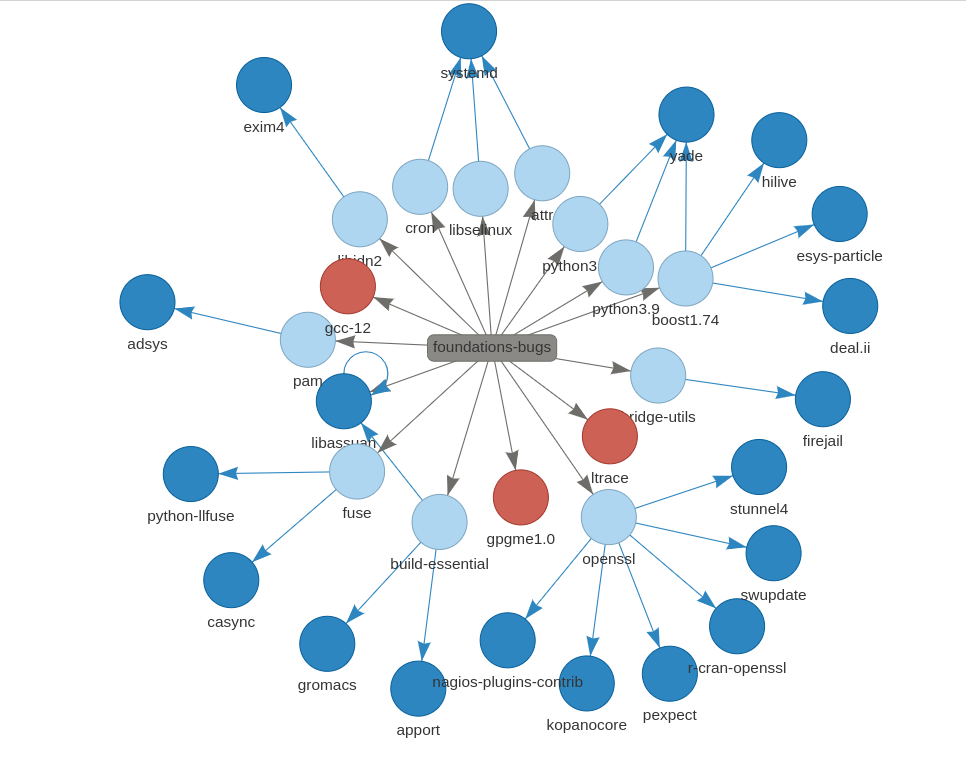
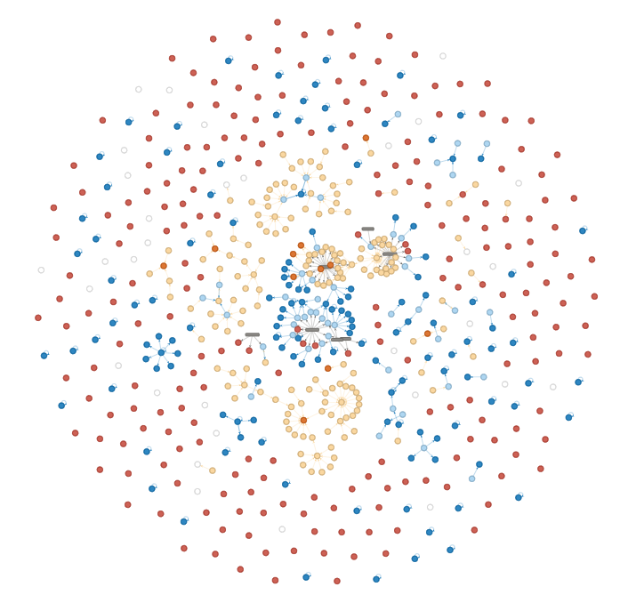
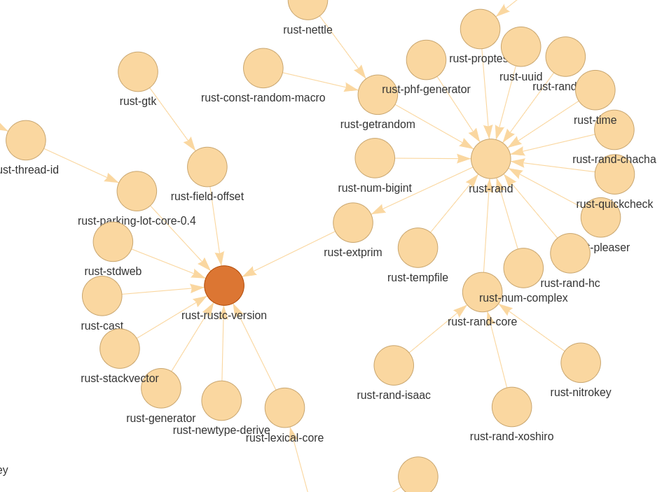

# Visual Excuses

*DISCLAIMER: This is alpha quality at best. Next steps will include proper packaging, refactoring testing etc*

Once a package is uploaded to the Ubuntu archive (dput) it triggers a series of tests and rebuilds across multiple packages in the archive.
Said package won't be able to migrate until it has build properly and all its dependencies have had successfull tests

This is a very simple view but this is what we call package migration.

When a package does't migrate, one would wonder why? what is its excuse?

Browsing and looking at https://people.canonical.com/~ubuntu-archive/proposed-migration/update_excuses.html can give excellent insight and help resolve the problem right away but in a lot of case, it could takea long time to find why a package is not migrating due the amount of packages trying to migrate at the same time abd blocking each others

Wouldn't it be great to have a visual representation of these excuses?

## indroducing visual-excuses

This tool leverage the excuses database located here https://people.canonical.com/~ubuntu-archive/proposed-migration/update_excuses.yaml.xz

This tool also uses the package per team mapping relevant to Canonical's internal teams which could help to show excuses per team. The content comes from http://reqorts.qa.ubuntu.com/reports/m-r-package-team-mapping.html


Finally this python program leverage pyvis python library
https://github.com/WestHealth/pyvis
https://pyvis.readthedocs.io/en/latest/

## Installation
First python requirements (we'll have setup.cfg nd all later, promise :))

```
$> git clone https://github.com/mclemenceau/visual-excuses.git
$> pip install yaml
$> pip install pyvis
```

## Usage
First need to refresh the data manually for now, we'll automate that in the future
```
$> ./update-data.sh
```
This script downloads the latest yaml excuses file

Then run visual-excuses for all team or one specific team
```
$> ./visual-excuses.py

$> ./visual-excuses.py --team foundations-bugs
```

## Legend
Control are fairly intuitive with the mouse to zoom in and out of the picture

 - **Arrows** : go in the direction of the problem, follow the arrow to find the reason a package isn't migrating

 - **Blue items**: represents autopkgtest failures related excuses, light blue means another package autopkgtest failure is blocking the migration. Dark blue mean this package autopkgtest are failing. Moving the mouse over the dot will show the exact failure and allow to click on hyperlink to go there.

 - **Red items**: missing builds. moving the mouse over the dot will show which architecture are missings

## Pictures

Team view



Everything



A dependencie cluster around rust

